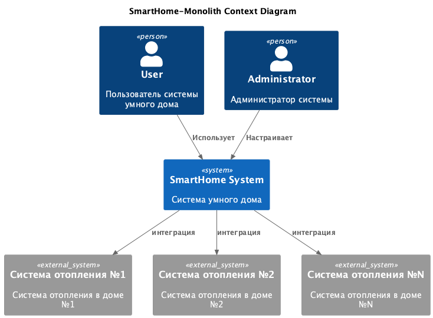
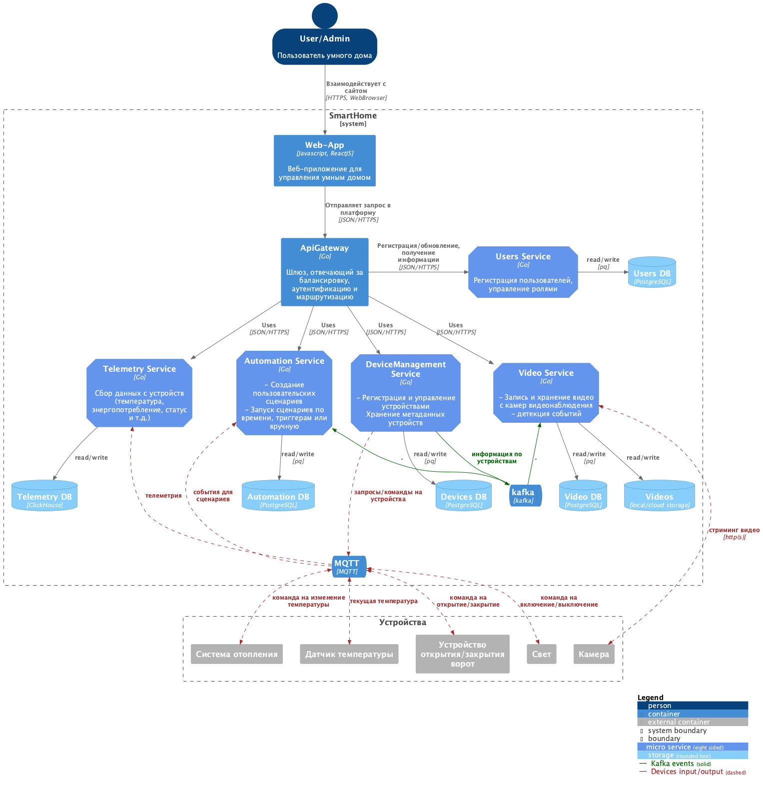
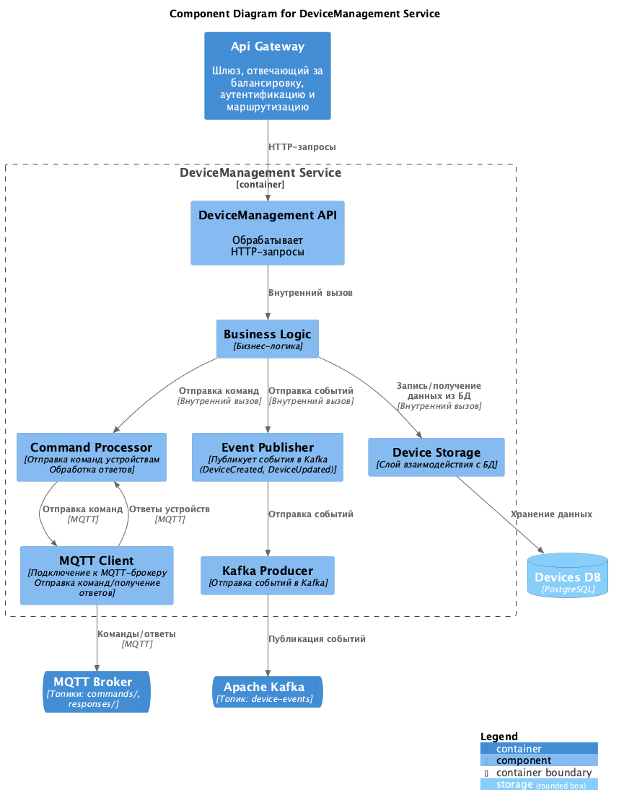
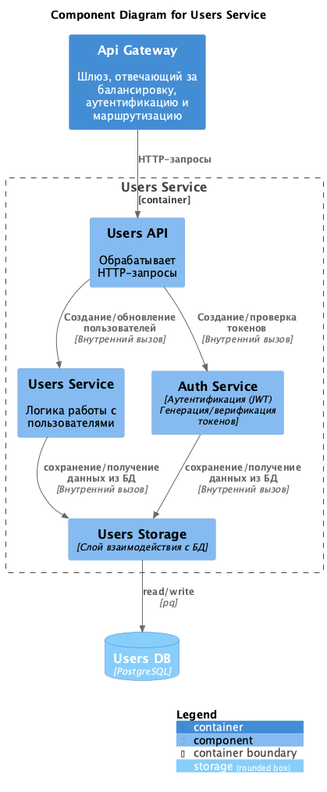
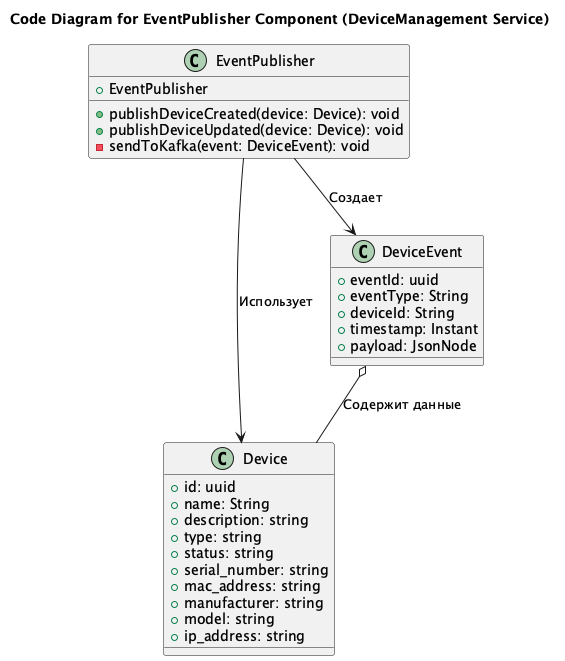
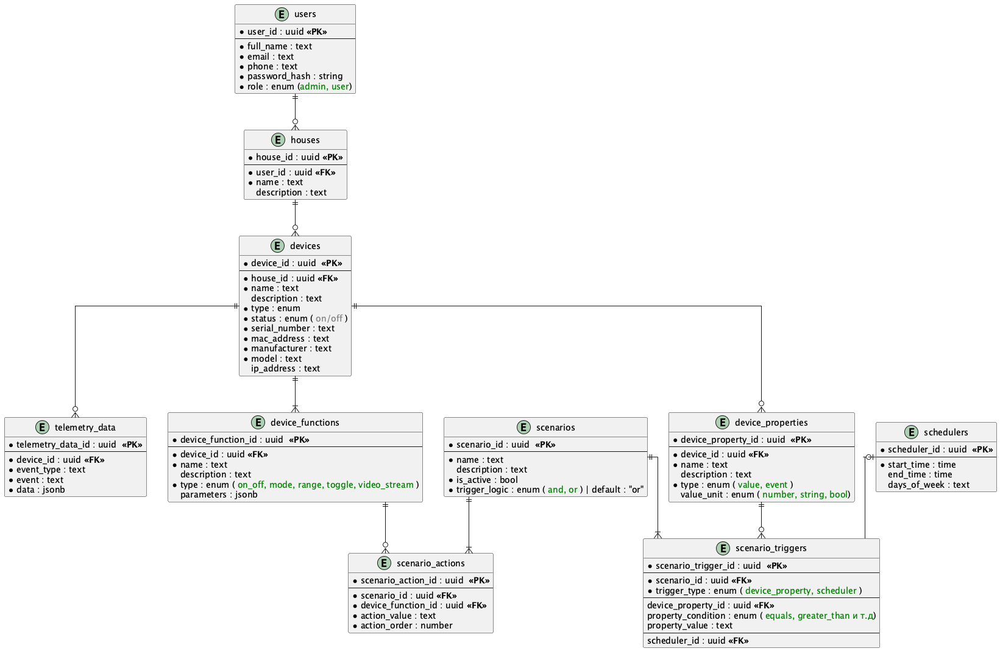

# Project_template

# Задание 1. Анализ и планирование

### 1.1 Описание функциональности монолитного приложения

**Управление отоплением:**

- Пользователи могут удалённо включать/выключать отопление в своих домах.
- Пользователи могут устанавливать необходимую температуру

**Мониторинг температуры:**

- Система получает данные о температуре с датчиков, установленных в домах. Пользователи могут просматривать текущую температуру в своих домах через веб-интерфейс.

### 1.2. Анализ архитектуры монолитного приложения

- **Язык программирования**: Go 
- **База данных**: PostgreSQL 
- **Архитектура**: Монолитная, все компоненты системы (обработка запросов, бизнес-логика, работа с данными) находятся в рамках одного приложения. 
- **Взаимодействие**: Синхронное, запросы обрабатываются последовательно. 
- **Масштабируемость**: Ограничена, так как монолит сложно масштабировать по частям. 
- **Развертывание**: Требует остановки всего приложения.

### 1.3. Определение доменов и границы контекстов

- домен: управление устройствами
  - поддомен: управление состоянием устройств
  - поддомен: управление сценариями 
- домен: мониторинг устройств
  - поддомен: мониторинг состояния устройств (состояние вкл/выкл, ошибки в работе и т.д.)
  - поддомен: сбор и агрегация метрик с устройств (температура, энергопотребление)

### 1.4. Визуализация контекста системы — диаграмма С4

# Задание 2. Проектирование микросервисной архитектуры

**2.1 Диаграмма контейнеров (Containers)**

**2.2 Диаграмма компонентов (Components)**

***2.2.1 DeviceManagement Service***

***2.2.2 Users Service***

**2.3 Диаграмма кода (Code)**

[//]: # (![SmartHome_DeviceManagementService_Component]&#40;diagrams/code/SmartHome_DeviceManagementService_Code_for_event_publisher.png&#41;)

# Задание 3. Разработка ER-диаграммы

# ✅  Задание 4. Создание и документирование API

### 4.1. OpenApi

[SmartHome_Microservices_ER_diagram](openapi/openapi.yaml)
